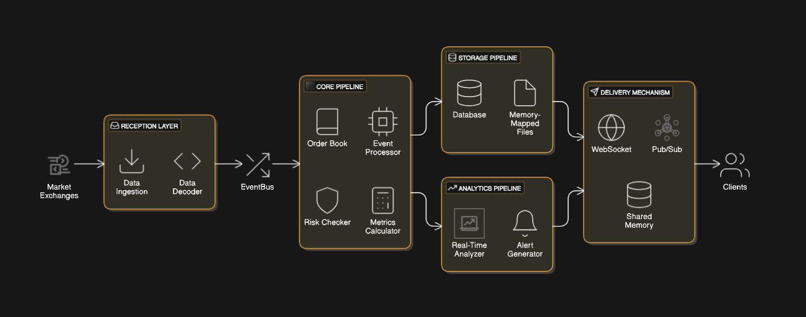

# High-Frequency Trading Architecture

## Overview
This project implements a **modular, extensible, and high-performance architecture** designed for high-frequency trading (HFT) systems. It allows seamless integration of data sources, customizable data processing pipelines, and flexible delivery mechanisms for downstream consumption. The architecture prioritizes **low latency**, **scalability**, **fault tolerance**, and **maintainability**, while ensuring real-time configurability.

---

## Key Features

1. **Pluggable Data Sources:** Easily integrate new data sources with configurable mappings for data formats and fields.
2. **Dynamic Processing Logic:** Configure and hot-reload processing rules, calculations (e.g., EMA, regressions), and transformations without restarting the system.
3. **Scalable Delivery:** Enable efficient data delivery via pub/sub messaging systems, WebSocket, or shared memory.
4. **High Availability:** Incorporate fault-tolerant mechanisms and redundancy to ensure seamless operation.
5. **Advanced Validation:** Built-in tools for simulation, backtesting, and real-time monitoring.
6. **Comprehensive Auditing:** Detailed logging of operations for compliance and troubleshooting.

---

## Architecture

### Updated Architecture Diagram


The system consists of several interconnected components designed to handle ingestion, processing, storage, and delivery of trading data efficiently.

---

### Components

#### 1. **Reception Layer**
**Purpose:** Ingest raw data from external sources and decode it.

- **Responsibilities:**
  - Connect to external endpoints (e.g., WebSocket, TCP).
  - Decode incoming data using configurable protocols (e.g., FIX, SBE).
  - Publish decoded events to the EventBus.

- **Enhancements:**
  - Support dynamic data source registration at runtime.
  - Add real-time metrics for monitoring data ingestion rates.

---

#### 2. **EventBus**
**Purpose:** Facilitate efficient inter-component communication.

- **Responsibilities:**
  - Distribute events to all subscribers (e.g., Core Pipeline, Analytics Pipeline).
  - Ensure low-latency communication with a lock-free queue implementation.

- **Enhancements:**
  - Replace in-memory EventBus with a distributed pub/sub system (e.g., Kafka or NATS) for scalability and resilience.
  - Provide event priority queues for critical data.

---

#### 3. **Core Pipeline**
**Purpose:** Transform, process, and validate data.

- **Responsibilities:**
  - Update order books and maintain consistent state.
  - Perform risk checks and calculations (e.g., EMA, regressions).
  - Emit processed events to downstream consumers.

- **Enhancements:**
  - Support configurable sharding to distribute workload across multiple threads or nodes.
  - Integrate real-time validation rules to catch anomalies early.
  - Enable on-the-fly reconfiguration of calculation parameters.

---

#### 4. **Storage Pipeline**
**Purpose:** Persist processed data for historical analysis and audit purposes.

- **Responsibilities:**
  - Store data in a high-performance database (e.g., MongoDB, Postgres).
  - Implement memory-mapped files for near-real-time storage needs.
  - Maintain write-ahead logs for fault tolerance.

- **Enhancements:**
  - Introduce distributed storage with replication to ensure data availability.
  - Add compression for archived data to reduce storage costs.

---

#### 5. **Analytics Pipeline**
**Purpose:** Perform real-time analysis on processed data.

- **Responsibilities:**
  - Generate derived metrics, trends, and alerts.
  - Support advanced statistical calculations and machine learning integrations.
  - Publish insights as new events for other components to consume.

- **Enhancements:**
  - Enable dynamic addition of analytical rules through a centralized configuration service.
  - Integrate anomaly detection models for preemptive insights.

---

#### 6. **Protocols**
**Purpose:** Handle encoding and decoding of data formats.

- **Responsibilities:**
  - Standardize communication across components using FIX, SBE, or custom formats.
  - Ensure seamless interoperability with external systems.

- **Enhancements:**
  - Add plugin support for easily extending the architecture to handle new protocols.

---

#### 7. **Common Utilities**
**Purpose:** Provide shared infrastructure and utilities.

- **Responsibilities:**
  - Manage CPU pinning and runtime configurations for optimal performance.
  - Expose low-level utilities like byte manipulation and checksum validation.
  - Centralize configuration management for the entire architecture.

- **Enhancements:**
  - Introduce a real-time configuration management system (e.g., Consul, ZooKeeper).
  - Implement unified logging and tracing for better observability.

---

## Event Flow

1. **Ingestion:** The Reception Layer ingests raw data, decodes it, and publishes structured events to the EventBus.
2. **Processing:** The Core Pipeline processes events, updates order books, performs calculations, and emits derived events.
3. **Storage:** The Storage Pipeline persists processed data for historical analysis or compliance purposes.
4. **Analytics:** The Analytics Pipeline analyzes events in real-time and generates insights or alerts.
5. **Delivery:** The system delivers processed data to consumers via WebSocket, pub/sub, or shared memory.

---

## Configuration

The architecture is highly configurable, supporting real-time updates without restarting the system.

### Configuration File Structure
```toml
[data_sources]
[source1]
type = "websocket"
endpoint = "wss://example.com/marketdata"
data_format = "FIX"
fields = ["symbol", "price", "volume"]

[processing]
ema_window = 10
use_mock_data = true

[delivery]
method = "pubsub"
target = "redis://localhost:6379"
```

### Real-Time Configuration Management
- Use Consul or ZooKeeper for centralized configuration storage.
- Enable hot-reloading of the configuration for minimal downtime during updates.

---

## Setup Process

### Prerequisites
- Install Rust: [https://www.rust-lang.org/tools/install](https://www.rust-lang.org/tools/install)
- Ensure services like Kafka or Redis are running for distributed messaging.

### Steps
1. **Clone the Repository:**
   ```bash
   git clone https://github.com/your-repo/hft_rust_agg.git
   cd hft_rust_agg
   ```

2. **Build the Project:**
   ```bash
   ./build.sh
   ```

3. **Run the Application:**
   ```bash
   ./run_main.sh
   ```

4. **Test the System:**
   ```bash
   cargo test --all
   ```

5. **Configure the System:**
   - Edit the `config.toml` file for data sources, processing rules, and delivery methods.

---

## Testing and Validation

- **Simulation:** Use a market simulator to validate processing logic.
- **Backtesting:** Replay historical data through the pipeline to evaluate system performance.
- **Monitoring:** Use integrated metrics and logs for real-time debugging and validation.

---

## Moving Forward

### Enhancements

1. **Latency Optimization:**
   - Optimize event handling with lock-free data structures and memory-mapped ring buffers.
   - Use distributed systems like Kafka or NATS for large-scale event management.

2. **Scalability:**
   - Introduce sharding and horizontal scaling for processing pipelines.
   - Distribute workloads using dynamic partitioning.

3. **Dynamic Reconfiguration:**
   - Use centralized configuration management for real-time updates.
   - Enable hot-reloading for processing rules and delivery mechanisms.

4. **Fault Tolerance:**
   - Add redundancy and failover mechanisms for all pipelines.
   - Use replicated storage to ensure data availability during outages.

5. **Advanced Analytics:**
   - Integrate real-time anomaly detection models and statistical tools.
   - Support customizable, on-the-fly analytics configurations.

6. **Compliance:**
   - Implement detailed audit trails for all operations.
   - Store logs in tamper-proof, long-term storage solutions.

---

This enhanced architecture is designed to meet the needs of demanding environments like hedge funds, offering high performance, scalability, and configurability for modern high-frequency trading systems.