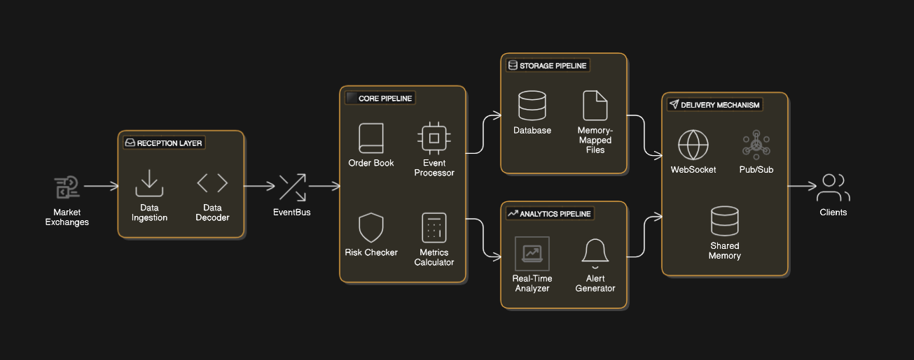

# High-Frequency Trading Architecture

## Overview
This project implements a **modular and extensible architecture** designed for high-frequency trading (HFT) systems. The primary goal is to allow seamless integration of data sources, customizable data processing pipelines, and flexible delivery mechanisms for downstream consumption. The architecture prioritizes low latency, scalability, and maintainability while ensuring high configurability.

### Key Features
1. **Pluggable Data Sources:** Easily integrate new data sources with configurable mappings for data formats and fields.
2. **Customizable Processing:** Define and configure processing logic, including calculations like EMA, regressions, and custom transformations.
3. **Flexible Delivery:** Deliver processed data through WebSocket, pub/sub messaging, shared memory, or other mechanisms.
4. **Modular Design:** Decoupled components allow for independent development, testing, and scaling of modules.
5. **High Performance:** Optimized for low-latency operations using Rust’s performance-focused design.

## Architecture



The system is composed of several modules organized into crates, each with a well-defined purpose:

### Components

#### 1. **Reception Layer**
- **Purpose:** Ingest raw data from various external sources (e.g., market data, trading exchanges).
- **Responsibilities:**
  - Connect to and receive data from external endpoints.
  - Decode incoming data using configurable formats (e.g., FIX, SBE).
  - Publish decoded events to the `EventBus`.

#### 2. **Core Pipeline**
- **Purpose:** Process and transform incoming events.
- **Responsibilities:**
  - Update stateful components like order books.
  - Perform risk checks and calculations (e.g., EMA, regressions).
  - Emit processed events for further consumption.

#### 3. **Storage Pipeline**
- **Purpose:** Persist processed data for historical analysis or audit purposes.
- **Responsibilities:**
  - Write data to a database (e.g., MongoDB, Postgres).
  - Maintain memory-mapped files for high-speed storage.
  - Implement journaling for fault tolerance.

#### 4. **Analytics Pipeline**
- **Purpose:** Perform real-time analysis and derive insights from processed data.
- **Responsibilities:**
  - Calculate statistics, trends, and alerts.
  - Generate derived events for consumption by other layers.

#### 5. **Protocols**
- **Purpose:** Handle encoding/decoding of events into standardized formats.
- **Responsibilities:**
  - Implement common protocols like FIX and SBE.
  - Ensure interoperability with external systems.

#### 6. **Common Utilities**
- **Purpose:** Provide shared utilities and infrastructure for the entire system.
- **Responsibilities:**
  - Manage CPU pinning and runtime configurations.
  - Implement an `EventBus` for intra-system communication.
  - Handle low-level utilities like byte manipulation.

### Event Flow
1. **Ingestion:** The Reception Layer receives raw data, decodes it, and publishes structured events to the EventBus.
2. **Processing:** The Core Pipeline subscribes to relevant events, processes them, and emits derived events.
3. **Storage:** The Storage Pipeline persists events for historical analysis.
4. **Analytics:** The Analytics Pipeline analyzes data in real-time and generates insights.
5. **Delivery:** Processed and analyzed data is delivered to consumers via configurable methods.

---

## Configuration
The architecture allows full configurability at every stage, from data ingestion to delivery. Configuration is handled through a unified `config.toml` file.

### Configuration File Structure
```toml
[data_sources]
# Define multiple data sources
[source1]
type = "websocket"
endpoint = "wss://example.com/marketdata"
data_format = "FIX"
fields = ["symbol", "price", "volume"]

[processing]
# Define calculations and their parameters
ema_window = 10
use_mock_data = true

[delivery]
# Specify delivery mechanisms
method = "pubsub"
target = "redis://localhost:6379"
```

### Adding a New Data Source
1. Define the source in `config.toml` under `[data_sources]`.
   - Specify the type (e.g., `websocket`, `file`, `http`).
   - Provide the endpoint and data format.
2. Implement the source-specific logic in the Reception Layer by creating a new module or extending an existing one.

### Configuring Processing Logic
1. Define calculations and parameters in `[processing]`.
2. Modify the Core Pipeline to read these parameters and apply the corresponding logic.

### Setting Up Delivery
1. Choose a delivery method (e.g., WebSocket, pub/sub, shared memory) in `[delivery]`.
2. Implement the delivery mechanism in the appropriate layer.

---

## Setup Process

### Prerequisites
- Install Rust: [https://www.rust-lang.org/tools/install](https://www.rust-lang.org/tools/install)
- Ensure necessary services (e.g., RabbitMQ, Redis) are running for delivery mechanisms.

### Steps

1. **Clone the Repository:**
   ```bash
   git clone https://github.com/your-repo/hft_rust_agg.git
   cd hft_rust_agg
   ```

2. **Build the Project:**
   ```bash
   ./build.sh
   ```

3. **Run the Application:**
   ```bash
   ./run_main.sh
   ```

4. **Test the System:**
   ```bash
   cargo test --all
   ```

5. **Configure the System:**
   Edit the `config.toml` file to define data sources, processing logic, and delivery mechanisms.

---

## Extensibility

### Adding a New Calculation
1. Define the calculation logic in the Core Pipeline.
2. Expose the new calculation as a configurable parameter in `config.toml`.

### Adding a New Delivery Mechanism
1. Implement the delivery logic in a new module.
2. Update the Storage or Analytics Pipeline to integrate the new delivery method.

### Plugging in a New Protocol
1. Implement the protocol in the Protocols crate.
2. Update the Reception Layer to use the new protocol for decoding incoming data.

---

## Testing and Debugging
- **Unit Tests:** Use `cargo test` for testing individual modules.
- **Integration Tests:** Place integration tests in the `tests` directory.
- **Benchmarking:** Use the `benches` crate to measure latency and throughput.
- **Logs:** Logs are stored in `build/logs/`. Review them for debugging issues.

---

## Moving Forward

To align the architecture with the stringent demands of top-tier hedge funds and ensure it meets the highest standards of performance, scalability, and reliability, the following enhancements are recommended:

### **1. Latency Optimization**
- Replace the in-memory `EventBus` with lock-free queues or memory-mapped ring buffers to minimize inter-thread communication latency.
- Leverage direct hardware integration such as RDMA (Remote Direct Memory Access) or NIC offloading for ingesting data with ultra-low latency.

### **2. Scalability Improvements**
- Introduce distributed message queues (e.g., Kafka, NATS) for handling high-frequency events and scaling horizontally.
- Implement sharding techniques to distribute workloads across multiple processing units effectively.

### **3. Dynamic Reconfiguration**
- Replace the static `config.toml` file with a centralized configuration management system (e.g., Consul, ZooKeeper) for real-time updates.
- Enable hot-reloading of configurations to adjust calculations or data mappings without restarting the system.

### **4. Fault Tolerance and High Availability**
- Add redundancy and failover mechanisms to ensure seamless operation during hardware or software failures.
- Use distributed storage with replication to guarantee data availability and fault tolerance.

### **5. Advanced Testing and Validation**
- Integrate a market simulator to replicate real-world exchange behavior for testing strategies and system performance.
- Use historical data for comprehensive backtesting of the entire pipeline.

### **6. Compliance and Auditing**
- Implement detailed logging of all operations, including timestamps and metadata, to meet regulatory requirements.
- Store logs in a tamper-proof system for long-term audit readiness.

### **7. Hardware Integration**
- Explore FPGA or GPU acceleration for repetitive calculations like EMA and risk checks to further reduce latency.
- Incorporate hardware-level optimizations for protocol decoding (e.g., FIX, SBE).

By addressing these areas, the architecture will not only enhance its suitability for demanding environments like hedge funds but also provide a robust foundation for future growth and innovation in high-frequency trading systems.

